# 🏝️ Morphing Island — Quickshell

Un **îlot dynamique flottant** pour [Hyprland](https://hyprland.org), écrit en QML
avec [Quickshell](https://quickshell.org). Une pilule unique en haut de l'écran
qui **se transforme** (morphing par ressorts physiques *critically damped*, sans
rebond) en OSD, notification, lanceur, calculatrice, calendrier, centre de
contrôle, menu d'alimentation ou invite d'authentification.

Toutes les icônes sont **vectorielles** (QtQuick.Shapes, zéro police d'icônes) :
nettes à n'importe quelle taille et recolorées par la couleur d'accentuation.

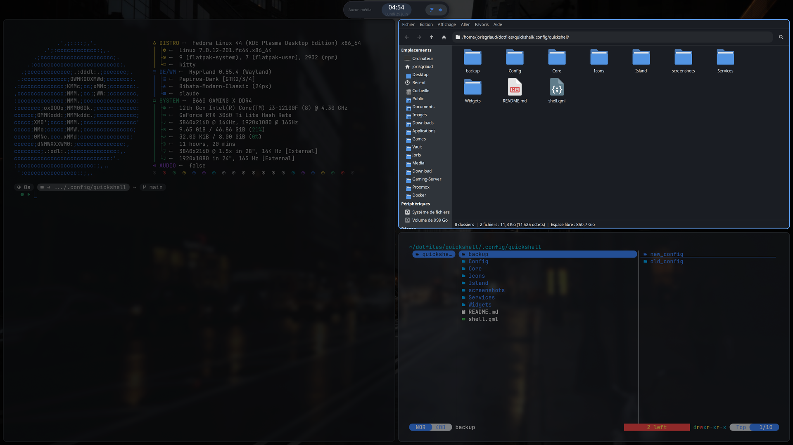

---

## ✨ Aperçu

**Au repos**, l'îlot affiche l'heure. **Au survol**, il s'étend : médias ·
horloge centrée · pilule de statuts (réseau, ventilateur, volume, batterie,
luminosité).

| Repos | Survol (vue étendue) |
|---|---|
|  |  |

**OSD** volume / luminosité (rond déplaçable à la souris) et **notifications**
(normale + critique en rouge, survol = pause du chrono pour lire) :

| OSD volume | Notification | Notification critique |
|---|---|---|
|  | 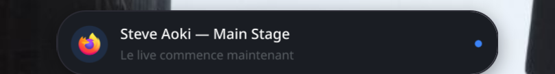 | 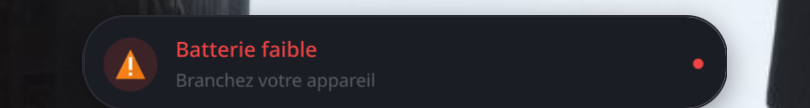 |

**Lanceur** (raccourci clavier, focus verrouillé, navigation 100 % clavier) —
applications, **calculatrice** (préfixe `=`) et **recherche de fichiers**
(préfixe `/`) :

| Applications | Calculatrice | Fichiers |
|---|---|---|
| 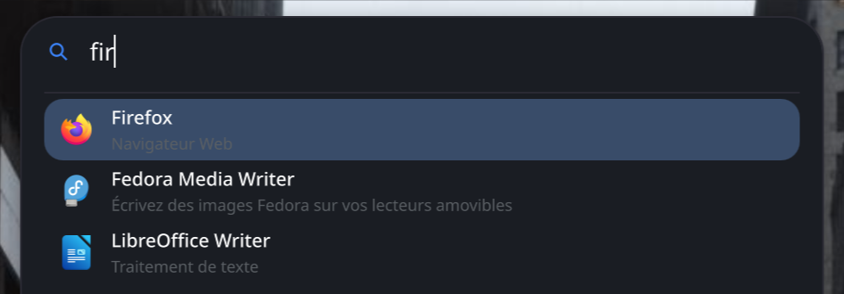 | 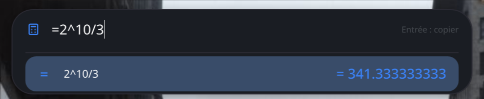 | 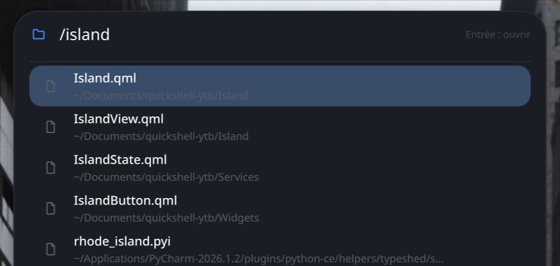 |

**Centre de contrôle** — tuiles (rond = bascule, fond = page de détail),
sliders volume/luminosité, carte média, historique des notifications
(clic = ouvrir, molette = retirer) :

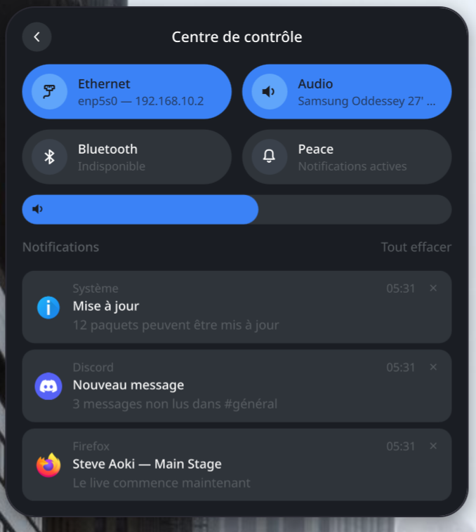

| Audio (sorties/entrées + renommage ✎) | Réseau | Bluetooth |
|---|---|---|
| 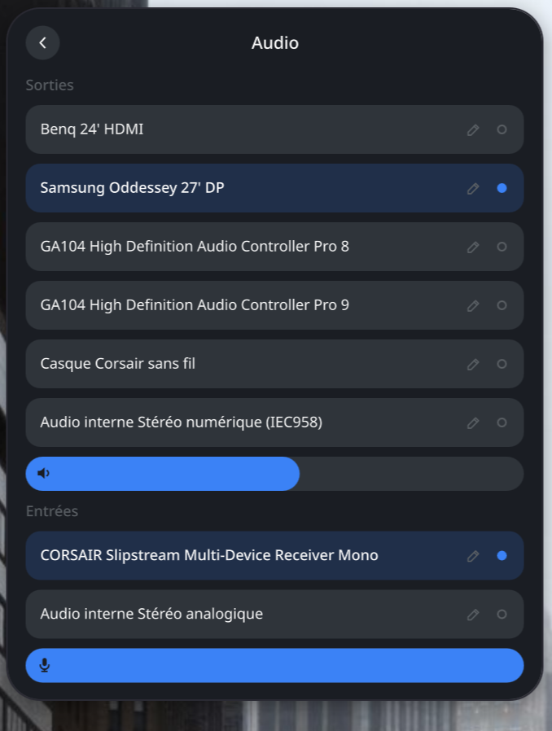 | 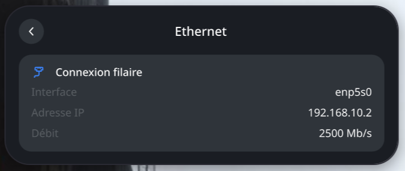 | 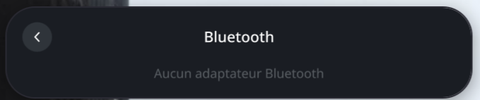 |

**Calendrier** (clic sur l'horloge) et **menu d'alimentation** (icônes seules,
navigation ←/→ ou Tab) :

| Calendrier | Menu power |
|---|---|
| 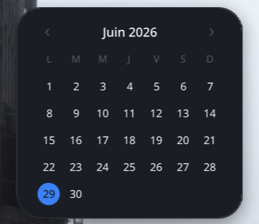 | 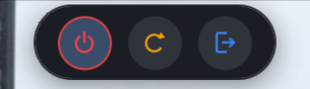 |

---

## 🧩 Fonctionnalités

- **Multi-écrans** : un îlot par écran ; OSD, notifications et panneaux ne
  sortent que sur l'écran focalisé.
- **Moteur d'animation** : ressort critiquement amorti (solution analytique
  exacte) — rapide, s'arrête net, **aucun overshoot**.
- **Icônes 100 % vectorielles** (Wi-Fi en jauge de signal, batterie style iOS
  avec éclair de charge, haut-parleur à ondes, soleil à rayons variables…).
- **Centre de contrôle** : Wi-Fi, Ethernet (interface + IP privée), Audio
  (choix des sorties/entrées **renommables**), Bluetooth, mode Ne pas déranger.
- **Lanceur** : recherche d'applications, **calculatrice** temps réel (`=`),
  **recherche de fichiers** (`/`, via `fd`).
- **Notifications** : file d'attente, pause au survol, critiques en rouge,
  mode « Peace », historique avec actions (ouvrir / retirer).
- **Polkit** : les demandes d'élévation s'affichent dans l'îlot.
- **Plein écran** : la barre passive se masque pour ne pas surgir sur une vidéo.
- **Tout est centré** verticalement dans la bande, marges symétriques réglables.


---

## 📦 Installation

> Cette config fait partie de mes [dotfiles](https://github.com/jorisgriaud/dotfiles)
> et se déploie avec **GNU Stow**.

### Dépendances

| Paquet | Rôle |
|---|---|
| **quickshell** (≥ 0.3) | le shell QML lui-même |
| **hyprland** | compositeur Wayland (raccourcis globaux, focus écran) |
| **brightnessctl** | luminosité (PC portables) |
| **fd** | recherche de fichiers du lanceur (`/`) |
| **hyprsunset** | mode nuit *(optionnel, tuile désactivée par défaut)* |
| polices **Inter** + **JetBrains Mono** | typographie |

Services utilisés automatiquement via Quickshell : **NetworkManager** (réseau),
**PipeWire** (audio), **UPower** (batterie), **BlueZ** (Bluetooth), **polkit**.

> ⚠️ Un seul service par session : si un **autre démon de notifications**
> (swaync, dunst, mako…) ou un **agent Polkit graphique** tourne déjà,
> désactive-le, sinon l'îlot ne pourra pas prendre la main.

### Déploiement (Stow)

```bash
git clone git@github.com:jorisgriaud/dotfiles.git ~/dotfiles
cd ~/dotfiles
stow quickshell          # crée les liens dans ~/.config/quickshell
quickshell -d            # lance le daemon (ou via exec-once Hyprland)
```

Autostart Hyprland :

```ini
exec-once = quickshell -d
exec-once = hyprsunset     # si tu actives la tuile « Mode nuit »
```

---

## ⌨️ Raccourcis & IPC

### Binds Hyprland recommandés

```ini
# Panneaux (raccourcis globaux natifs)
bind  = SUPER, SPACE,  global, island:launcher   # lanceur
bind  = SUPER, ESCAPE, global, island:power      # menu power
bind  = SUPER, N,      global, island:peace      # Ne pas déranger

# Volume — wpctl suffit, PipeWire déclenche l'OSD tout seul
bindel = , XF86AudioRaiseVolume, exec, wpctl set-volume -l 1.0 @DEFAULT_AUDIO_SINK@ 5%+
bindel = , XF86AudioLowerVolume, exec, wpctl set-volume @DEFAULT_AUDIO_SINK@ 5%-
bindl  = , XF86AudioMute,        exec, wpctl set-mute @DEFAULT_AUDIO_SINK@ toggle

# Luminosité — via l'IPC de l'îlot pour un OSD instantané
bindel = , XF86MonBrightnessUp,   exec, qs ipc call island brightnessUp
bindel = , XF86MonBrightnessDown, exec, qs ipc call island brightnessDown
```

### Commandes IPC (`qs ipc call island <fn>`)

| Fonction | Effet |
|---|---|
| `toggleLauncher` | ouvre/ferme le lanceur |
| `toggleControlCenter` | ouvre/ferme le centre de contrôle |
| `toggleCalendar` | ouvre/ferme le calendrier |
| `togglePower` | ouvre/ferme le menu d'alimentation |
| `togglePeace` | bascule le mode Ne pas déranger |
| `ccPage <network\|audio\|bluetooth>` | ouvre directement une page du centre de contrôle |
| `volumeUp` / `volumeDown` / `muteToggle` | volume |
| `brightnessUp` / `brightnessDown` | luminosité |
| `reload` | rechargement dur (recrée les fenêtres) |

### Gestes souris

| Geste | Effet |
|---|---|
| Survol de la pilule | extension fluide |
| Clic dans le vide | épingle / désépingle l'îlot ouvert |
| Clic en dehors d'un panneau | le referme |
| Clic sur une notification | ouvre l'app/la page · molette = retire |

### Personnalisation

Tout est centralisé dans `Config/Theme.qml` (couleurs, typographie,
épaisseur de police, couleurs des tuiles et du menu power, vitesses des
ressorts) et `Config/Settings.qml` (tailles, marges, délais, préfixes du
lanceur). Les icônes lisent `Theme.accent`/`Theme.fg` : changer une couleur
recolore tout le shell.

---

## 🙏 Crédits

- Concept inspiré de cette vidéo : **[Morphing Island](https://youtu.be/wcm95W876OU)**.
- Construit avec **[Quickshell](https://quickshell.org)** sur
  **[Hyprland](https://hyprland.org)**.
